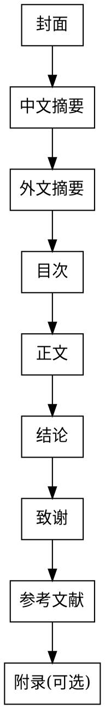

# Graduation Thesis Writing Skill (毕设文档编写)

## Overview

本skill用于按照中国高校毕业设计说明书的格式规范编写Word文档，包含：
- 字体、字号、行距、章节结构等详细规范
- 34+个学术写作Prompt（选题、结构、摘要、方法、讨论、润色等）
- 降低AI率、提升学术表达的专用工具

## Document Structure



## Format Specifications

### Font & Size Reference

| 元素 | 中文字体 | 英文字体 | 字号 | 对齐 | 行距 |
|------|---------|---------|------|------|------|
| 章标题 | 黑体 | - | 小三号 | 左对齐 | 段前0.5行,段后0.5行 |
| 节标题(2级) | 黑体 | - | 四号 | 左对齐 | - |
| 条标题(3级) | 黑体 | - | 小四号 | 左对齐 | - |
| 正文 | 宋体 | Times New Roman | 小四号 | 两端对齐 | 1.5倍 |
| 摘要/结论/致谢标题 | 黑体 | - | 小三号 | 居中 | - |
| 目次标题 | 黑体 | - | 小三号 | 居中 | - |
| 参考文献标题 | 黑体 | - | 小三号 | 居中 | - |
| 表格/插图 | 宋体 | Times New Roman | 五号 | - | - |
| 页码 | - | - | 阿拉伯数字 | 页脚居中 | - |

### Word Font Size Mapping (磅值)

| 中文字号 | 磅值 |
|---------|------|
| 小三号 | 15pt |
| 四号 | 14pt |
| 小四号 | 12pt |
| 五号 | 10.5pt |

## Pre-prepared References

参考文献已在开题报告中准备完毕，共20篇（含3篇外文），详见 [references.md](references.md)。

**使用说明:** 编写毕设文档时直接引用这些参考文献，无需另外查找。在正文中使用 `[1][2][3]` 格式引用。

## Section Content Requirements

### 1. 封面 (Cover Page)

```
20xx届毕业生
毕业设计说明书

题    目: [论文题目]
院系名称：[院系]
专业班级：[班级]
学生姓名：[姓名]
学    号：[学号]
指导教师：[教师姓名]
教师职称：[职称]

2026年 5月 22日
```

### 2. 中文摘要 (Chinese Abstract)

- **字数要求**: 约400字
- **内容要素**: 研究背景、研究目的、技术方案、主要成果、结论意义
- **关键词**: 3-5个，用分号分隔

### 3. 外文摘要 (English Abstract)

- **Title**: 小三号Times New Roman
- **字数要求**: 约300词
- **Keywords**: 3-5个，与中文关键词对应

### 4. 目次 (Table of Contents)

- 列出"章"、"条"二级标题
- 格式: `章号 章标题 ............ 页码`

### 5. 正文 (Main Body)

**推荐章节结构:**

```
1  绪论
   1.1 研究背景与意义
   1.2 国内外研究现状
   1.3 研究内容与论文结构

2  相关技术与理论基础
   2.1 [相关技术1]
   2.2 [相关技术2]

3  系统需求分析与设计
   3.1 需求分析
   3.2 系统架构设计
   3.3 数据库设计

4  系统实现
   4.1 开发环境与技术选型
   4.2 核心模块实现
   4.3 关键技术实现

5  系统测试与分析
   5.1 测试环境
   5.2 功能测试
   5.3 性能测试

6  结论
```

### 6. 结论 (Conclusion)

- 总结全文工作成果
- 说明创新点和贡献
- 指出研究不足与展望

### 7. 致谢 (Acknowledgement)

- 感谢指导教师
- 感谢帮助过的老师和同学
- 感谢家人支持

### 8. 参考文献 (References)

**数量要求:** 不少于15篇，至少2篇外文

**格式示例:**
```
期刊类: [1] 作者. 论文题目[J]. 期刊名, 年, 卷(期): 起止页码
图书类: [2] 作者. 书名. 出版地: 出版社, 年, 页码
外文类: [3] Author. Title[J]. Journal, Year, Vol(Issue): Pages
```

---

## Writing Prompts (写作提示词库)

> 来源: [academic-ai-prompt](https://github.com/bohyy/academic-ai-prompt)，共34+个Prompt
> 完整版详见 [writing_prompts.md](writing_prompts.md)

### 核心Prompt速查

#### 摘要与绪论 (直接可用)

**Prompt 3.2: 撰写高质量摘要**
```
我的论文的关键信息：
- 研究问题：[描述]
- 研究方法：[描述]
- 主要发现：[列举3-5个]
- 重要结论：[描述]

摘要长度限制：[如400字]

请帮我撰写一个高质量的摘要，要求：
1. 首句吸引注意力（指出问题的重要性）
2. 清晰说明研究问题
3. 简洁概括研究方法
4. 突出主要发现（重点！）
5. 阐明重要结论
6. 最后一句表述研究的意义
```

**Prompt 3.3: 撰写引人入胜的绪论**
```
我的研究背景：
- 该领域的重要性：[描述]
- 现有问题/空白：[描述]
- 我的研究如何填补这个空白：[描述]

绪论的结构应该是：
1. 开场（为什么这个领域很重要？）- 50-100字
2. 现有研究概览 - 150-200字
3. 存在的问题/机遇 - 100-150字
4. 我的研究的创新性 - 100-150字
5. 论文的主要贡献 - 50-100字
6. 论文的组织结构 - 30-50字

字数要求：[如800-1000字]
```

#### 方法与结果

**Prompt 4.1: 撰写清晰的方法部分**
```
我的研究采用的方法：
- 研究对象/材料：[描述]
- 主要实验步骤：[详述]
- 关键参数和条件：[列举]
- 数据分析方法：[描述]

请帮我撰写一个清晰的方法部分，要求：
1. 足够清晰，使同行能够复现实验
2. 足够简洁，避免冗余细节
3. 逻辑清晰，步骤顺序明确
4. 强调方法的创新之处（如果有）
```

#### 讨论与结论

**Prompt 5.1: 撰写有深度的讨论**
```
我的主要发现是：[列举3-5个关键发现]
这些发现的意义：[描述它们意味着什么]
现有文献中的相关研究：[列举1-3个相关工作]
我的发现与现有研究的关系：[描述相同/不同/进步]
我的发现的局限：[坦诚地列举可能的局限]
未来的研究方向：[描述可能的后续研究]

请帮我撰写讨论部分，要求：
1. 首先重述主要发现
2. 解释这些发现的机制或原因
3. 与现有理论/研究进行对比
4. 强调创新之处和突破
5. 坦诚地讨论局限和不足
6. 提出未来研究方向
```

**Prompt 5.2: 撰写强有力的结论**
```
论文的核心贡献：[列举主要贡献]
关键发现的总结：[总结最重要的结果]
对该领域的影响：[描述这个研究如何改变了认识]
实际应用前景：[描述可能的应用]
未来研究的建议：[提出后续研究方向]

字数要求：[如300-500字]
```

---

### 文本优化 (降低AI率) ⭐ 重要

**Prompt 7.2: 降低AI率**
```
这是一段我用AI生成的文本：
[粘贴AI生成的文本]

请帮我降低这段文本的AI痕迹，使其更像人类写作，要求：
1. 打破重复的AI表述模式和固定句式
2. 增加更多具体细节和个性化表述
3. 使用更自然、多样的词汇搭配
4. 避免过度使用AI喜欢的套路短语
5. 加入适当的学术见解和个人判断
6. 保持原有的学术严谨性

具体改进策略：
- 识别并改变AI常见的模式化开场
- 使用更多元的句式结构
- 加入作者的独特观点或解读
- 避免"显而易见"、"众所周知"等通用表述
```

**Prompt 7.5: 提升学术表达水平**
```
这是我论文中的一个表述段落：
[粘贴原文]

目标期刊/学科：[如计算机类期刊]

请帮我提升这段文本的学术表达水平，要求：
1. 使用更高阶的学术词汇
2. 采用更严谨的学术表述方式
3. 增强表述的权威性和说服力
4. 使用更精准的学科术语
5. 改进逻辑表述和论证结构

学术用语升级示例：
- "很重要" → "具有重要的学术意义和实际应用价值"
- "不同" → "存在显著差异"
- "影响" → "对...产生深远的影响"
```

**Prompt 7.9: 论文文本综合优化（一站式）**
```
这是我论文的一个完整章节或主要部分：
[粘贴完整文本]

当前存在的问题：
[列举你知道的问题，如AI率高、文风不一致、表述冗长等]

请进行综合优化，包括：
1. 降低AI率
2. 润色学术表达
3. 优化内容结构
4. 检查学术准确性
5. 符合学位论文要求

请提供：
- 改进后的完整文本
- 主要改动点的说明
```

---

### 学位论文特别建议

针对学位论文(thesis)的建议：
- **深度要够**: 使用 Prompt 1.4 评估研究深度
- **结构要完整**: 使用 Prompt 2.1 设计论文结构
- **逻辑要严密**: 使用 Prompt 2.4 检查逻辑
- **细节描述要充分**: 使用 Prompt 4.3 撰写详细结果

---

## Python Implementation

使用 `python-docx` 创建符合规范的文档:

```python
from docx import Document
from docx.shared import Pt, Cm, Inches
from docx.enum.text import WD_ALIGN_PARAGRAPH
from docx.oxml.ns import qn

# 字号映射
FONT_SIZES = {
    '小三': 15,
    '四号': 14,
    '小四': 12,
    '五号': 10.5
}

def set_chinese_font(run, font_name='宋体', size_key='小四', bold=False):
    """设置中文字体"""
    run.font.size = Pt(FONT_SIZES[size_key])
    run.font.bold = bold
    run.font.name = 'Times New Roman'
    run._element.rPr.rFonts.set(qn('w:eastAsia'), font_name)

def add_chapter_title(doc, text):
    """添加章标题 (小三黑体,加粗,段前段后0.5行)"""
    para = doc.add_paragraph()
    para.paragraph_format.space_before = Pt(6)
    para.paragraph_format.space_after = Pt(6)
    run = para.add_run(text)
    set_chinese_font(run, '黑体', '小三', bold=True)

def add_section_title(doc, text):
    """添加节标题 (四号黑体,加粗)"""
    para = doc.add_paragraph()
    run = para.add_run(text)
    set_chinese_font(run, '黑体', '四号', bold=True)

def add_body_text(doc, text):
    """添加正文 (小四宋体,1.5倍行距)"""
    para = doc.add_paragraph()
    para.paragraph_format.line_spacing = 1.5
    run = para.add_run(text)
    set_chinese_font(run, '宋体', '小四')

def add_centered_title(doc, text):
    """添加居中标题 (小三黑体)"""
    para = doc.add_paragraph()
    para.alignment = WD_ALIGN_PARAGRAPH.CENTER
    run = para.add_run(text)
    set_chinese_font(run, '黑体', '小三', bold=True)
```

---

## Common Mistakes

| 错误 | 正确做法 |
|------|---------|
| 参考文献格式不统一 | 严格按格式规范，期刊用[J]，图书用[M] |
| 摘要字数过多/过少 | 中文约400字，英文约300词 |
| 章节编号不规范 | 使用1, 1.1, 1.1.1三级编号 |
| 图表无编号/标题 | 图标题在图下方，表标题在表上方 |
| 行距不统一 | 正文1.5倍，目次/参考文献18磅 |
| 英文使用宋体 | 英文统一用Times New Roman |
| AI痕迹明显 | 使用Prompt 7.2/7.9降低AI率 |

---

## Word Count Requirements

### 总字数规范

| 项目 | 要求 |
|------|------|
| **毕设总字数** | 8000-15000字（正文部分，不含摘要、目次、参考文献） |
| 中文摘要 | 约400字 |
| 英文摘要 | 约300词 |
| 参考文献 | ≥15篇 (≥2篇外文) |

### 各章节字数分配建议

| 章节 | 建议字数 | 占比 |
|------|---------|------|
| 第1章 绪论 | 1500-2000字 | ~15% |
| 第2章 相关技术与理论基础 | 2000-2500字 | ~20% |
| 第3章 系统需求分析与设计 | 2000-2500字 | ~20% |
| 第4章 核心算法设计与实现 | 2000-2500字 | ~20% |
| 第5章 系统实现 | 1500-2000字 | ~15% |
| 第6章 系统测试与分析 | 1000-1500字 | ~10% |
| 结论 | 500-800字 | - |
| 致谢 | 300-500字 | - |

**注：** 具体字数可根据项目实际情况调整，但总字数应控制在8000-15000字范围内。

---

## Quick Reference

**必写章节:**
1. 封面 → 2. 中文摘要 → 3. 外文摘要 → 4. 目次 → 5. 正文 → 6. 结论 → 7. 致谢 → 8. 参考文献

**字数要求:**
- **总字数: 8000-15000字**
- 中文摘要: ~400字
- 参考文献: ≥15篇 (≥2篇外文)

**字体规范:**
- 标题: 黑体
- 正文: 宋体 + Times New Roman
- 字号: 小三(标题) / 四号(节) / 小四(正文)

**行距:**
- 正文: 1.5倍
- 目次/参考文献: 18磅

**完整Prompt库:** [writing_prompts.md](writing_prompts.md) (34+个Prompt)
